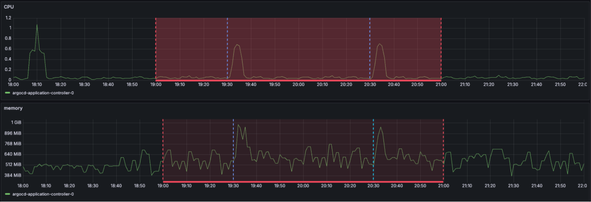
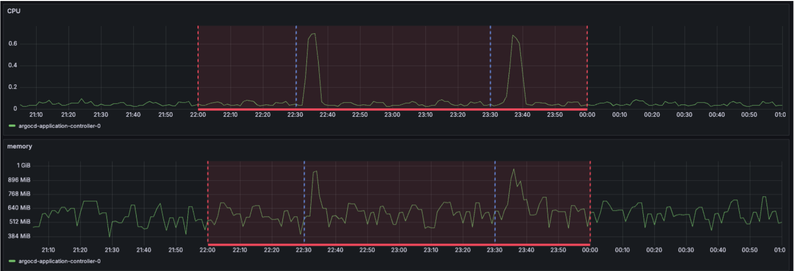
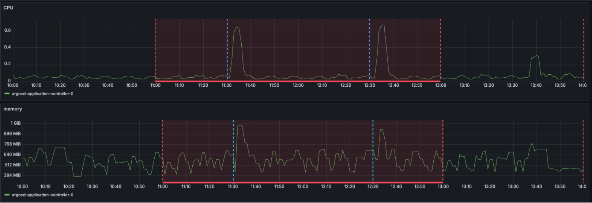
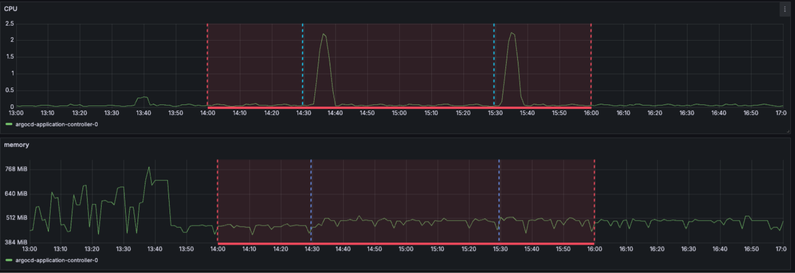
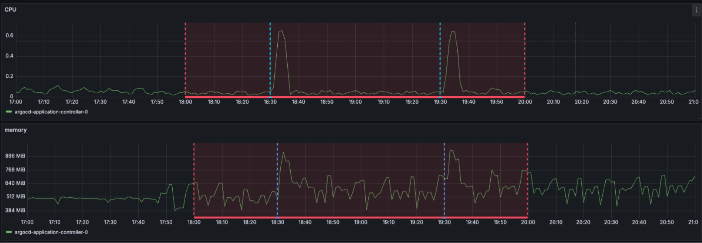

# Test plan - app sync in a single light loading cluster

## Test environment:
- Pet cluster created by cluster orchestrator
- Deploy new argocd
- In-cluster self-host argocd: https://github.com/Julian-Chu/argocd-memory-optimization-test/tree/main/argocd
- Guestbook app * 41 (synced): https://github.com/Julian-Chu/argocd-memory-optimization-test/tree/main/guestbook
- No CPU and Memory request and limitation
- Keep 2 hours no configuration changes to collect metrics, sync the 41 guestbook apps per hour

| Test case | Controller status processors | Controller operation processors | GOMEMLIMIT | Resource inclusion | Time(GMT+2) | Config changes |
| :--- | :--- | :--- | :--- | :--- | :--- | :--- |
| 1 | 20(default) | 10(default) | No | false | 2025/09/16 19:00-21:00   Sync1: 19:30   Sync2: 20:30 | [0c9a060c...](https://github.com/Julian-Chu/argocd-memory-optimization-test/commit/0c9a060c213c62dffd77fd1edd9290a02d28e9ec) |
| 2 | 2 | 10 | No | false | 2025/09/16 22:00-24:00   Sync1: 22:30   Sync2: 23:30 | [059872a6...](https://github.com/Julian-Chu/argocd-memory-optimization-test/commit/059872a650bef0c27556c5f64a815457d9e9d87c) |
| 3 | 2 | 1 | No | false | 2025/09/17 11:00-13:00   Sync1: 11:30   Sync2: 12:30 | [db065f01...](https://github.com/Julian-Chu/argocd-memory-optimization-test/commit/db065f01691c849c481f395fa2ae24042784122a) |
| 4 | 20 | 10 | 500MiB | false | 2025/09/17 14:00-16:00   Sync1: 14:30   Sync2: 15:30 | [efd919a9...](https://github.com/Julian-Chu/argocd-memory-optimization-test/commit/efd919a9a8e75a39dbe8506991b9c219ad073d97) |
| 5 | 20 | 10 | No | yes | 2025/09/17 18:00-20:00   Sync1: 18:30   Sync2: 19:30 | [3daaf0e6...](https://github.com/Julian-Chu/argocd-memory-optimization-test/commit/3daaf0e650c08abd08099768ee763e0a00ec7ee3) |

---

## Test case 1: (default setting, baseline)

**CPU:**
* Normal: < 0.1
* Spike after sync: 0.7

**Memory:**
* Normal: 384 - 765 MiB
* Spike after sync: 1003 Mib

---

## Test case 2: (reduce status processors from 20 to 2)

**CPU:**
* Normal: < 0.1
* Spike after sync: 0.7

**Memory:**
* Normal: 403 - 740 MiB
* Spike after sync: 1000 Mib

**Summary:**
No obvious changes

---

## Test case 3: (reduce operation processors from 10 to 1)

**CPU:**
* Normal: < 0.1
* Spike after sync: 0.667

**Memory:**
* Normal: 396 - 714 MiB
* Spike after sync: 998 Mib

**Summary:**
No obvious changes

---

## Test case 4: (GOMEMLIMIT: 500MiB)

**CPU:**
* Normal: < 0.12
* Spike after sync: 2.24

**Memory:**
* Normal: 423 - 516 MiB
* Spike after sync: 520 Mib

**Summary:**
* The memory usage remain stable near the GOMEMLIMIT value
* CPU utilization spikes to three times its normal baseline during peak load.
* The CPU spike is expected because the garbage collector can be triggered more aggressively

---

## Test case 5: (add resource.inclusion)

**CPU:**
* Normal: < 0.1
* Spike after sync: 0.645

**Memory:**
* Normal: 391 - 706 MiB
* Spike after sync: 957 Mib

*(Image of argocd_cluster_api_resource_objects and argocd_cluster_api_resources graphs)*

**Argocd managed api resources:**
* 672 -> 241
* Objects: 4200 -> 3000 ( still high)

**Summary:**
* No obvious changes in the CPU and memory, but huge reduction in the resources.
* Reducing the number of resources included should lower memory usage. However, we're not seeing that here, possibly because the guestbook only has few resources.
* 3000 is still a high number, any opportunity to reduce it ?

---

## Summary:

After running tests in the light loading cluster, our tests indicate that GOMEMLIMIT effectively reduces memory usage and spikes in lightly loaded clusters, though it causes a temporary CPU spike. Given that CPU is a burstable resource and the ArgoCD application controller is not latency-sensitive, these short-term spikes are acceptable.

We propose setting GOMEMLIMIT to 90% of the memory limit to mitigate memory spikes, while closely monitoring CPU and sync performance.

**More information:**
* **Single light loading cluster:** Observed a peak memory usage of 1 GB.
* **Impact of resource.inclusion:** While resource.inclusion reduced the number of ArgoCD-managed API resources, no corresponding decrease in memory usage was observed. This limited impact might be attributed to the test's scope, as the guestbook application uses only a single pod and may not accurately represent real-world scenarios.
* **Status and operation processor:** These components had no noticeable impact, likely because the applications were consistently synchronized, eliminating the need to apply new resources.
